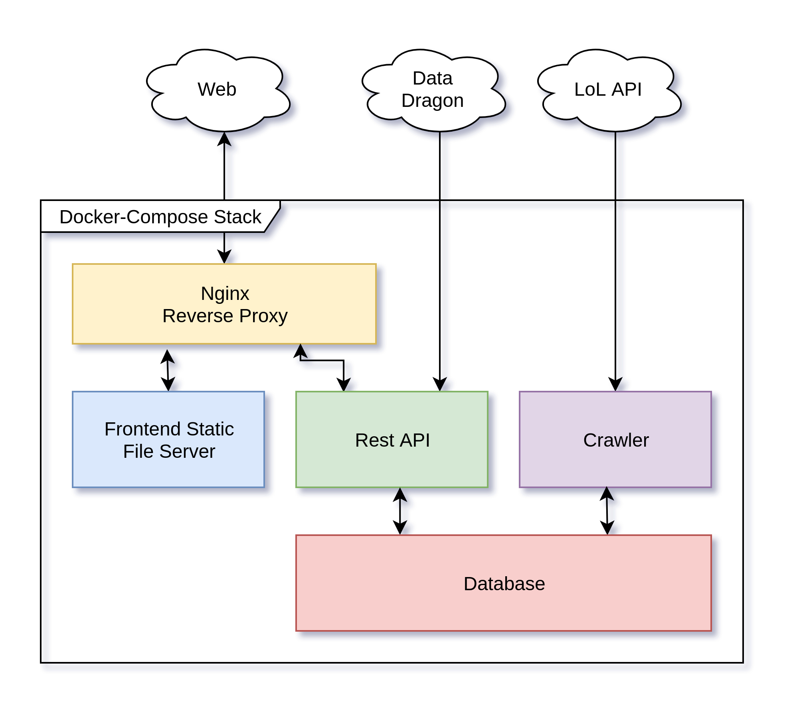

<div align="center">
     <!--  -->
     <h1>~ supercharge ~</h1>
     <strong>League of Legends mastery points: supercharged analytics tool</strong><br/><br/>
     <a href="https://github.com/zekroTJA/supercharge/actions"></a>&nbsp;
     <a href="https://zekro.de/discord"></a>
</div>

---

## Information & Motivation

This web application allows collecting and analyzing League of Legends champion mastery points stats of summoners who have registered their account on the page to be tracked. This allows keeping track and analyzing your porgress on champion masteries and being able to observe your progerssion.

This porject is strongly inspired by [masterypoints.com](https://masterypoints.com), which provides a detailed insight about your chamion mastery points and world wide rankings, but leaks of providing detailed analysis and tracking of the progress of your mastery points and [Orianna Bot](https://orianna.molenzwiebel.xyz), which provides detailed mastery point information via Discord.

The name `supercharge` is inspired by the E spell of the League of Legends champion Kai'Sa, which is the main champion of a good friend of mine. And it fits well to the functionality of the app to provide "supercharged" analytics about champion mastery points.

---

## Structure

This project is split up in seperate "microservices" and access layers for better maintainability and deploy.

Every services is provided and deployed as docker image so that the whole server stack can be deployed with the provided docker-compose configuration.

### [Crawler](Crawler)

This .NET Core (3.1) console application crawls, depending on the registered accounts in the database, mastery point data of these users from the League of Legends API and saves them in the database.

### [DDragonAccessLayer](DDragonAccessLayer)

This .NET Standard 2.1 Class Library provides access to the League of Legends Data Dragon API which provides information about champions and patch versions.

### [DatabaseAccessLayer](DatabaseAccessLayer)

This is a .NET Standard 2.1 Class Library which acts as access layer for the database and provides the Entity Framework database context and the database access class which can be implemented via dependency injection.

### [RestAPI](RestAPI)

This ASP.NET Core (3.1) application provides a REST API gateway to the data provided by the database which is used by the front end web application.

### [RiotAPIAccessLayer](RiotAPIAccessLayer)

This .NET Standard 2.1 Class Library provides an access layer to the Riot League Of Legends REST API which is used by the Crawler and REST API application.

### [Shared](Shared)

This is another .NET Standard 2.1 Class Library which provides simple general purpose shared functionalities which are used by other class libraries or applications.

### [WebApp](WebApp)

This project contains the sources of an Angular web application which compiled files are served by a light weight HTTP file server written in Go. This will be the web front end for the average user.



---

## Setup & Hosting

> I will only provide guidence on how to set up the server environemtn using the provided Dockerfiles and `docker-compose.yml`. I will neither provide any binaries nor any documentation on how to compile and set up the server components outside of docker. If you want to do so nevertheless, you should have the knowledge on compiling .NET Core projects and running them.

First of all, clone the repository somewhere on your server:
```
$ git clone https://github.com/zekroTJA/supercharge . --branch master --depth 3
```

After that, you should check the configuration n the `docker-compose.yml` and define secrets like the Riot API key or the password for the database account. To get an API key for the Riot API, you need to register a product application [here](https://developer.riotgames.com/app-type).

Then, build all nessecary images with the build scripts provided in the `docker-compose.yml`:
```
$ docker-compose build
```

After that and after checking and configuring the `docker-compose.yml`, you are ready to start up the services with the following command:
```
$ docker-compose up -d
```

Eventually, you can check the status of the services:
```
$ docker-compose ps
```

---

© 2020 Ringo Hoffmann (zekro Development)  
Covered by the MIT Licence.
